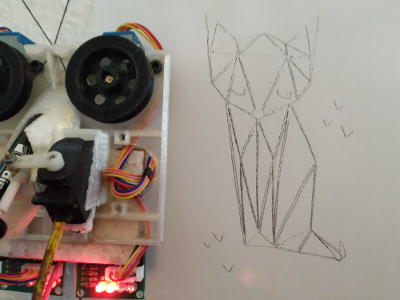
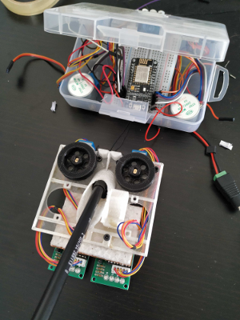
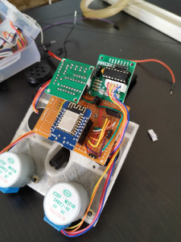
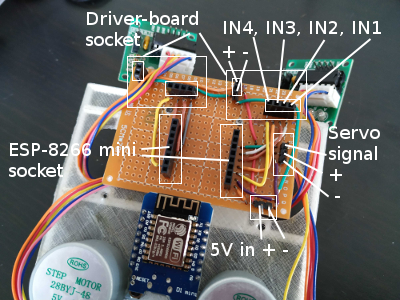

# ESP-8266 wall-plotter
Work in progress - no Version (still struggeling with &pi;)




### Why?
This project is inspired by https://www.hackster.io/fredrikstridsman/stringent-the-15-wall-plotter-d965ca - good work!

Time goes by... I have no Arduino left. But there are 3 Node-MCU boards in my garage.
My needs were to use a `ESP 8266` board with its WiFi capabilities instead of a *poor* Arduino.


### Hardware:
- 1 x NodeMCU 12e (ESP8266, I used a mini)
- 2 x step motor 28BYJ-48
- 1 x case (https://github.com/snebragd/stringent/blob/master/Hardware/)
- 2 x spools (spool2.stl)
- 1 x Servo SG90
- min. 3 meters of fishing line. Depends on your wanted canvas size.
- a pen
- rubber band



### Software:
**You need a [rest-api plugin for your browser](https://github.com/RESTEDClient/RESTED) or a tool like [postman](https://www.getpostman.com/)!**
- Arduino IDE
- gimp
- node.js

## What happens until now:

### Spawns own WiFi when no WiFi is reachable. 
 - you can enter your own WiFi parameter. Just POST a json ``` {"ssid":"MY-SSID","password":"PASSWORD"} ``` to the server.
 - Default IP from own **Accespoint 192.168.0.1**
 - Your uploaded WiFI credentials are stored in a persistant config.json

### *minimal* CLI tool to convert *gimp*-svg to plotter-data 
See the svg-converter [README.md](svg-converter/README.md):

```
> cd wall-plotter/svg-converter 
> node svg2data.js svg/vws.svg
```

This will create a `wall-plotter.data` file for upload.


### Upload plots with WiFi 
 - Upload `wall-plotter.data` to ESP8266 `/upload`. A webform for file upload is presented.

### Set configuration parameter
- Change the output size. POST ``` {"zoomFactor":"1"} ``` to `/zoom`. 1 (no zoom) is default. 
- Set canvas width and the position of the wall-plotter. POST ```{"canvasWidth":"1000","currentLeft":"330","currentRight":"999","zoomFactor":"1"}``` to `/config`.

### Start / Stop the wall-plotter on demand
- POST `/plot/start`: This starts plotting your uploaded *wall-plotter.data*
- POST `/plot/stop`: This will interrupt the running plot, if there is any.
- GET `/plot`: Shows the last stored *wall-plotter.data*

[See all API-endpoints in wall-plotter::serverRouting()](https://github.com/ivosdc/wall-plotter/blob/6ce040f6c54414caa6de0233a5dc669bce96f97b/wall-plotter.ino#L422)


### Soldering



### Used libraries:
- https://github.com/rydepier/Arduino-and-ULN2003-Stepper-Motor-Driver
- ArduinoJson6
